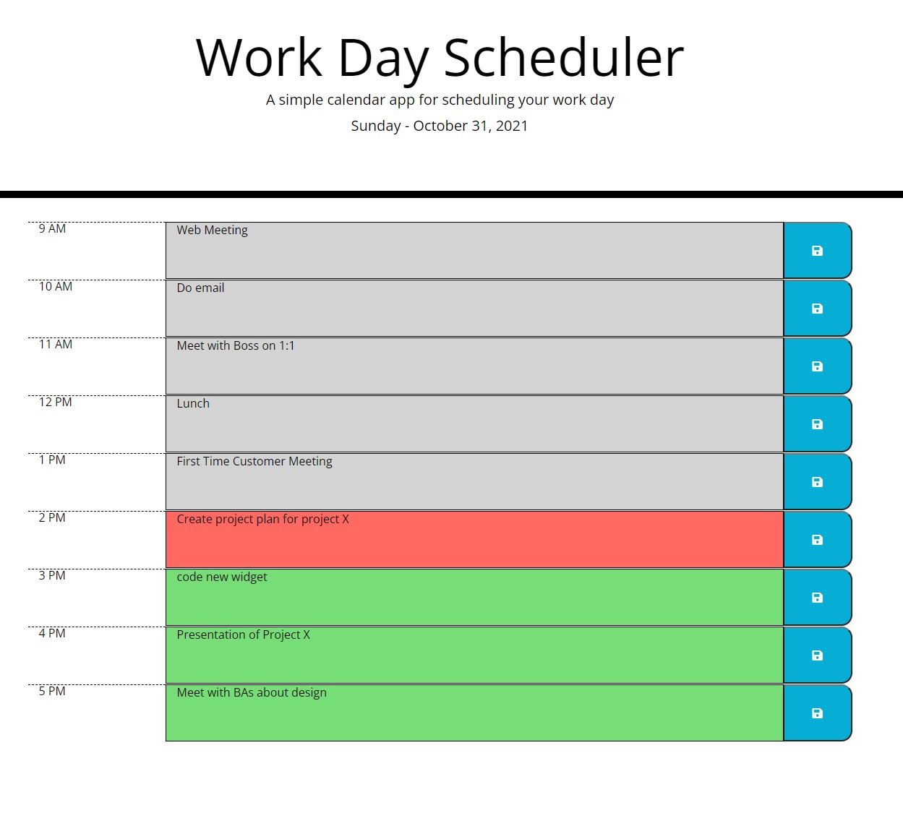

# Work Day Scheduler Challenge by Mark Kanczuzewski

The purpose of this exersize was to create an planning application that displays the hours for an average workday. Each hour has the ability to save task descriptions to local storage and then load them on page load as needed. The hours are color coded based on the current time to show past, present, and future. The current day and date are displayed at the top of the page and every 30 minutes the page content refreshes, which will then move the color codes as appropriate. 

Installation: This website is deployed at the following location:
https://mkanczuzewski.github.io/Module-5-Challenge-MRK-103121/

Usage: This site is for educational purposesly only.

Credits: Mark Kanczuzewski

Copyright (c) [2021] [Mark Kanczuzewski]

Permission is hereby granted, free of charge, to any person obtaining a copy
of this software and associated documentation files (the "Software"), to deal
in the Software without restriction, including without limitation the rights
to use, copy, modify, merge, publish, distribute, sublicense, and/or sell
copies of the Software, and to permit persons to whom the Software is
furnished to do so, subject to the following conditions:

The above copyright notice and this permission notice shall be included in all
copies or substantial portions of the Software.

THE SOFTWARE IS PROVIDED "AS IS", WITHOUT WARRANTY OF ANY KIND, EXPRESS OR
IMPLIED, INCLUDING BUT NOT LIMITED TO THE WARRANTIES OF MERCHANTABILITY,
FITNESS FOR A PARTICULAR PURPOSE AND NONINFRINGEMENT. IN NO EVENT SHALL THE
AUTHORS OR COPYRIGHT HOLDERS BE LIABLE FOR ANY CLAIM, DAMAGES OR OTHER
LIABILITY, WHETHER IN AN ACTION OF CONTRACT, TORT OR OTHERWISE, ARISING FROM,
OUT OF OR IN CONNECTION WITH THE SOFTWARE OR THE USE OR OTHER DEALINGS IN THE
SOFTWARE.